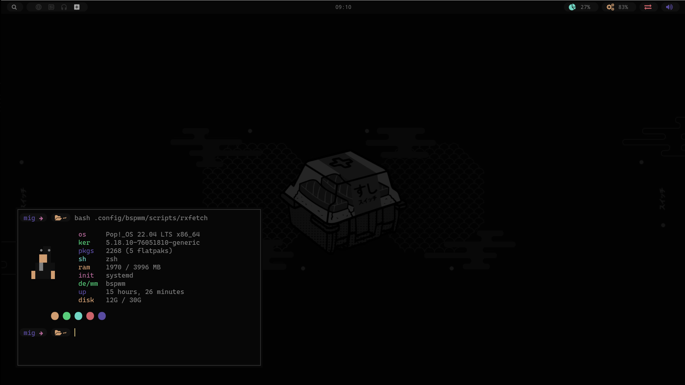
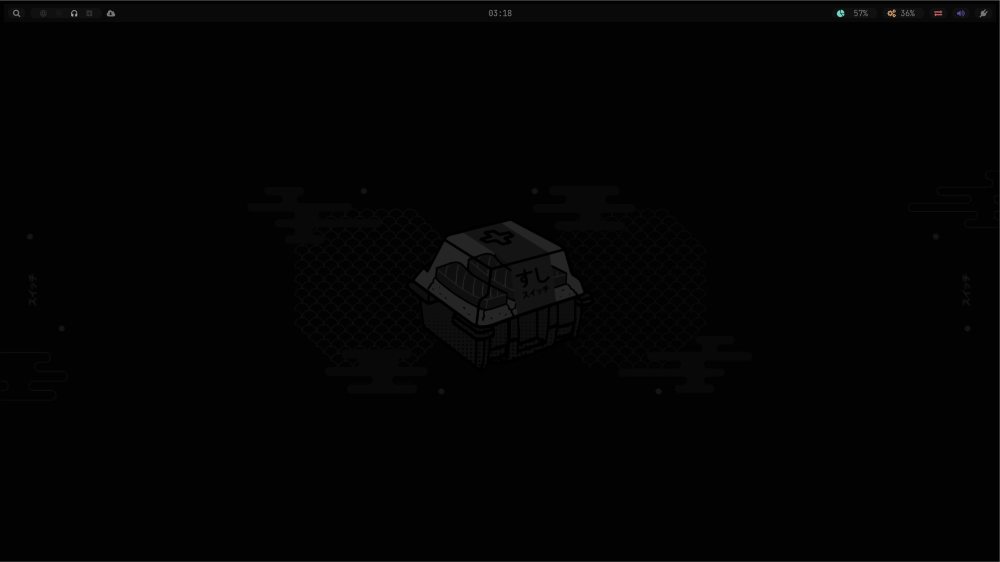
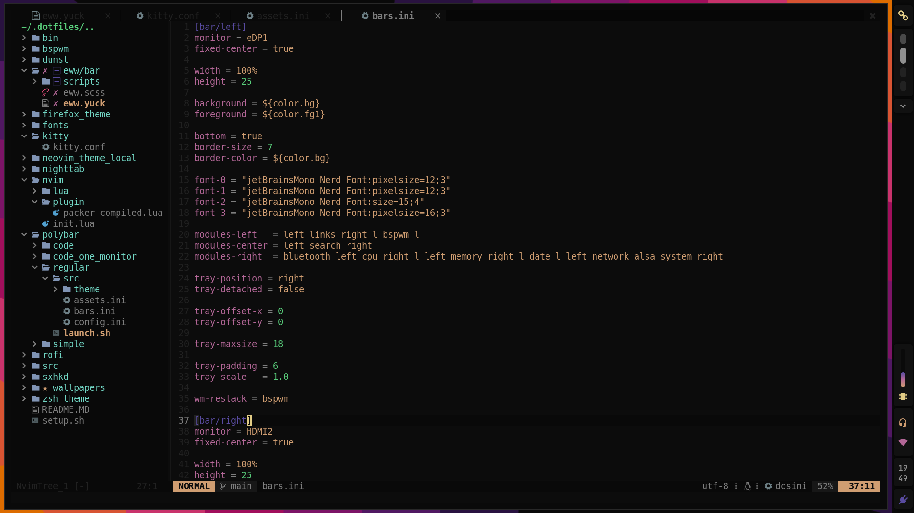
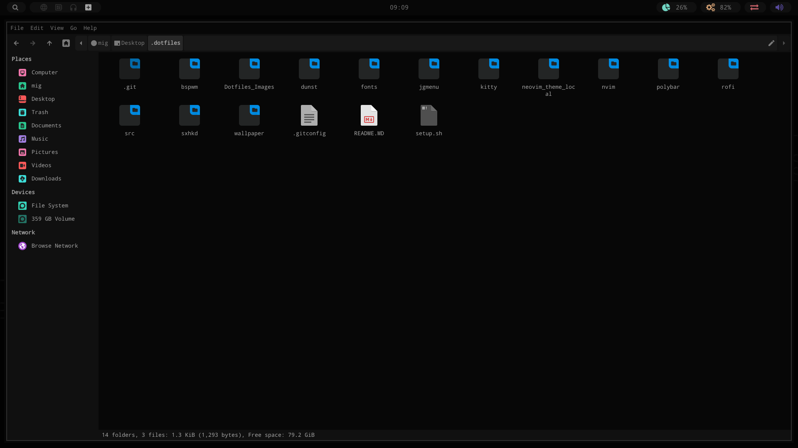
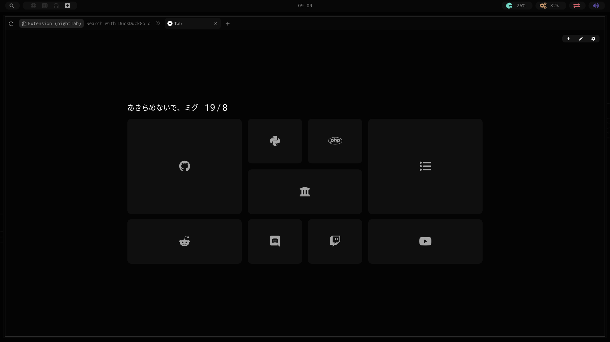

<h1 align="center">Code Dotfiles</h1>



- Os: [Pop-os](https://pop.system76.com/)
- Wm: [Bspwm](https://github.com/baskerville/bspwm)
- Bar: [Polybar](https://github.com/polybar/polybar)
- Launcher: [Rofi](https://github.com/davatorium/rofi)
- Lock: [BetterLockScreen](https://github.com/betterlockscreen/betterlockscreen)
- Terminal: [Kitty](https://sw.kovidgoyal.net/kitty/)
- Notifications: [Dunst](https://github.com/dunst-project/dunst)


<br><br>
<br><br>
<h2 align="left">⚙️ To Install.</h2>

<h3>🤏 First install the <b>dependencies</b></h3>

```
sudo apt install tree feh rofi npm ranger cava polybar git build-essential kitty dunst scrot jgmenu cmake libtool libtool-bin libintl-perl libdbus-1-dev libx11-dev libxinerama-dev libxrandr-dev libxss-dev libglib2.0-dev libpango1.0-dev libgtk-3-dev libxdg-basedir-dev libnotify-dev curl wmctrl slop xclip
```

<br>

- Execute setup.sh
- Enter the `neovim_theme_local` and execute install.sh to install a colorscheme for nvim <b>(opitional)</b>

<details>
  <summary><h3>🖥️ Desktop</h3></summary>
  
</details>

<details>
  <summary><h3>💾 Neovim</h3></summary>
  
</details>

<details>
  <summary><h3>📁 Gtk Theme</h3></summary>
  
</details>

<details>
  <summary><h3>🦊 Firefox</h3></summary>
  
</details>
