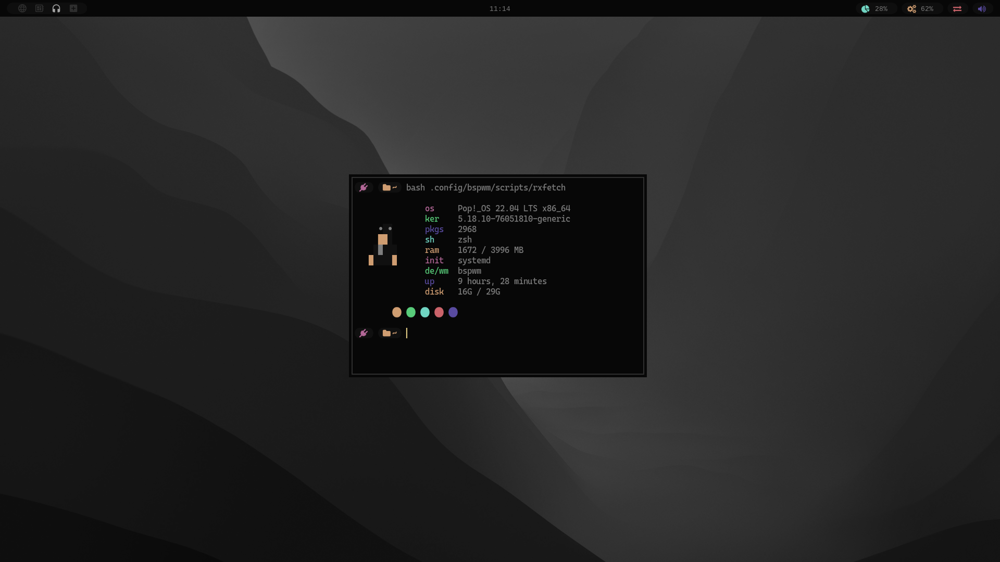

<h1 align="center">Code Dotfiles</h1>

- Os: [Pop-os](https://pop.system76.com/)
- Wm: [Bspwm](https://github.com/baskerville/bspwm)
- Bar: [Polybar](https://github.com/polybar/polybar)
- Launcher: [Rofi](https://github.com/davatorium/rofi)
- Menu: [Jgmenu](https://github.com/johanmalm/jgmenu)
- Lock: [BetterLockScreen](https://github.com/betterlockscreen/betterlockscreen)
- Terminal: [Kitty](https://sw.kovidgoyal.net/kitty/)

<h2 align="left">To "Install".</h2>

- Execute setup.sh
- Enter the `neovim_theme_local` and execute install.sh to install a colorscheme for nvim (opitional)

